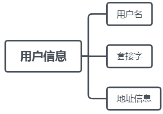

# TCP聊天室

# 介绍

使用Qt5开发，带界面的TCP聊天室

# 运行环境

操作系统：Windows 10

编程语言：Python 3.7.6

第三方包：pyside2 5.15.1

# 功能模块

|  |
| :----------------------------------------------------------: |
|                         图 功能模块                          |

# 流程图

|  |
| :----------------------------------------------------------: |
|                        图 服务端流程                         |

|  |
| :----------------------------------------------------------: |
|                       图 客户端流程图                        |

# 设计思路

## 基于TCP通信

由于TCP的可靠性，面向连接特点，在本例中，客户端与服务器之间的通信是基于TCP协议的。服务器可以通过TCP套接字实时掌握与客户端之间的通信情况。

## 收发并行

为了客户端界面不会因为接收信息而遭到阻塞无法操作，另外开辟了子线程来接收消息。有些如IO这些比较耗时间的操作，会另外开辟新线程来处理。

## 用户信息

|  |
| :----------------------------------------------------------: |
|                         图 用户信息                          |

在服务器中使用了列表存储每一个用户信息，为了区分不同用户，用户名必须是唯一不可重复的。其中的套接字是服务器发挥中间站转发的关键。

## 消息

通过固定格式的消息实现客户端与服务端之间的通信。

### 消息格式

|  |
| :----------------------------------------------------------: |
|                         图 消息格式                          |

在本例中，服务器主要是发挥了中间站转发作用，通过消息中的接收者来进行消息的转发。

### 消息类型

|  |
| :----------------------------------------------------------: |
|                         图 消息类型                          |

服务器通过消息类型和消息内容来进行进一步的消息处理，是转发还是返回响应内容。

## 粘包

由于TCP面向字节流的特点，在本例中，可能会出现多条消息同时接收的情况。因此，可以通过特定字符作为分割标志来把多条消息分开；为了防止消息内容中出现分割标志导致消息分割混乱，该字符的选择应选取ASCII码中的不可打印字符/控制字符。