# UI设计

# 核心功能界面演示

## 登录界面

| 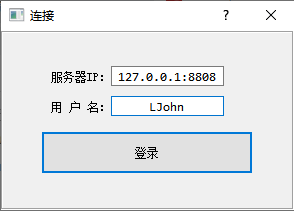 |
| :----------------------------------------------------------: |
|                      图 登录对话框界面                       |


## 聊天窗口界面

### 聊天展示

| 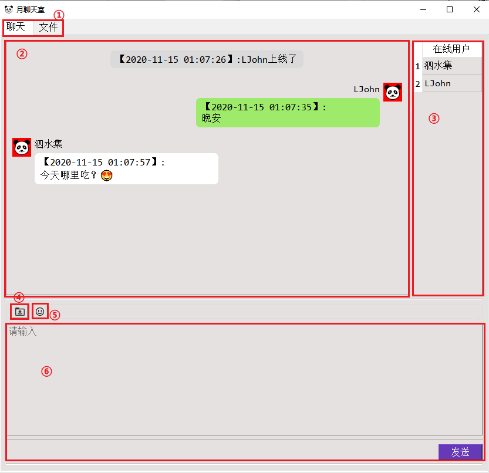 |
| :----------------------------------------------------------: |
|                        图 聊天标签页                         |


| 序号 |         名称         |
| :--: | :------------------: |
|  ①   | 聊天/文件切换标签页  |
|  ②   |    聊天内容展示区    |
|  ③   |   在线用户展示列表   |
|  ④   |     文件上传按钮     |
|  ⑤   | 表情符号面板打开按钮 |
|  ⑥   |    聊天内容编辑区    |


### 表情符号面板

| 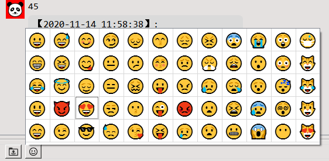 |
| :----------------------------------------------------------: |
|                       图 表情符号面板                        |


## 文件界面

### 文件展示

| 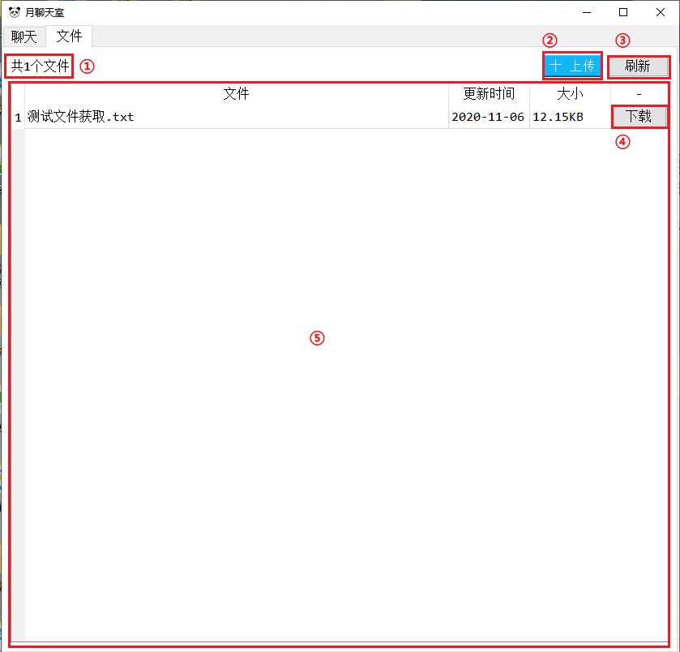 |
| :----------------------------------------------------------: |
|                        图 文件标签页                         |


| 序号 |          名称          |
| :--: | :--------------------: |
|  ①   |      文件个数标签      |
|  ②   |      文件上传按钮      |
|  ③   | 群文件展示表格刷新按钮 |
|  ④   |      文件下载按钮      |
|  ⑤   |     群文件展示表格     |


### 文件上传

| 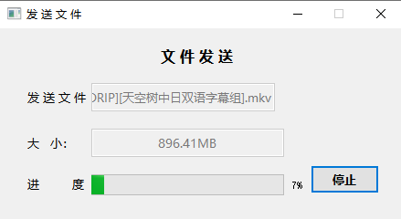 |
| :----------------------------------------------------------: |
|                      图 文件上传对话框                       |


### 文件下载

| 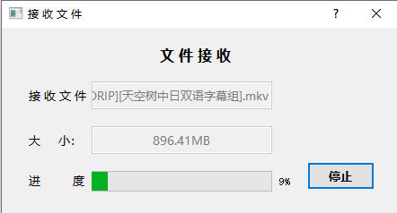 |
| :----------------------------------------------------------: |
|                      图 文件下载对话框                       |


# 消息气泡设计

## 消息气泡类型

消息气泡分三种类型。

### 公共通知

显示用户上下线和文件上传的消息，在聊天展示区中间位置，气泡呈现灰色背景色，如下图所示：

| 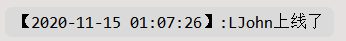 |
| :----------------------------------------------------------: |
|                     图 公共通知消息气泡                      |


### 自己的消息

显示用户自己发出的聊天消息，在聊天展示区右边位置，气泡呈现绿色背景色，如下图所示：

| 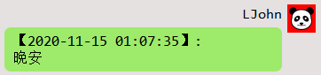 |
| :----------------------------------------------------------: |
|                        图 自己的消息                         |


### 他人的消息

显示其他用户发出的聊天消息，在聊天展示区左边位置，气泡呈现白色背景色，如下图所示：

| 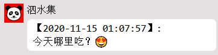 |
| :----------------------------------------------------------: |
|                         图 他人消息                          |


## 源码实现

在mainboard.py源文件中，通过调用refresh_chatMsgShowListWidget()函数根据传入的参数来生成对应的气泡

```python
def refresh_chatMsgShowListWidget(self, userName, msg, isMe=1, msgBgColor='#9eea6a',userHeader='ui/ico/ico.png'):
    '''
    更新聊天展示区/生成消息气泡
    :param userName: 聊天消息发出者
    :param msg: 消息内容
    :param isMe: 消息气泡类型
    :param msgBgColor: 消息气泡背景色
    :param userHeader: 聊天消息气泡头像
    :return: 
    '''
    lwit = QListWidgetItem() # 列表项
    self.chatMsgShowListWidget.addItem(lwit)
    # 根据isMe的值生成相应的消息气泡
    if 0 == isMe: 
        mif = self.newMsgItemInformFrame(msg, msgBgColor) # 生成公共通知气泡
    else:
        mif = self.newMsgItemChatFrame(userName, msg, isMe, msgBgColor, userHeader) # 生成聊天气泡

    # 调整列表项大小
    lwit.setSizeHint(QSize(400, mif.height()))  
    # 把消息气泡与列表项绑定在一起，添加到列表（聊天展示区）中
    self.chatMsgShowListWidget.setItemWidget(lwit, mif)

    # 滚动条到末尾
    self.chatMsgShowListWidget.setCurrentRow(self.chatMsgShowListWidget.count() - 1)
```


# 表情符号面板设计

## 基本原理

在windows系统下，微软输入法自带的表情符号，会自动把对应字符串转换成emoji表情，表现如图：


| 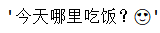 |
| :----------------------------------------------------------: |
|                    图 命令行中的表情符号                     |

| 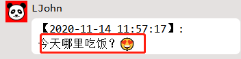 |
| :----------------------------------------------------------: |
|                     图 界面中的表情符号                      |


微软输入法的表情符号的bytes编码是连续的，可以设置起始表情符号，通过对表情符号的bytes编码进行递增，从而获取一定的表情符号字符串。

## 源码实现

在tools.py源文件获取表情符号，代码如下：

```python
def getEmoji():
    '''
    获取微软输入法的emoji
    :return: emoji列表
    '''
    emoji = []
    # 把str类型的表情符号转换成bytes类型
    start = int.from_bytes('😀'.encode(), byteorder='big', signed=False)
    end = int.from_bytes('😼'.encode(),byteorder='big', signed=False)

    # 对bytes编码进行递增
    for str in range(start, end, 1):
        # 把bytes类型表情符号转换成str类型，并存储
        emoji.append(struct.pack('>L', str).decode())
    return emoji
```


在emojiboard.py源文件中实现面板表格数据更新

```python
def refresh_emojiTableWidget(self):
    '''
    填充emoji表格并设置窗口大小
    :return:
    '''
    self.setWindowFlags(Qt.FramelessWindowHint | Qt.Popup) # 设置窗口样式为无标题栏和弹出式顶层
    etw = self.emojiTableWidget # 表格面板
    etw.setRowCount(5) # 表格列
    etw.setColumnCount(0) # 表格行

    emojiList = getEmoji() # 获取表情符号列表
    rows = etw.rowCount() 
    index = 0 # 表情符号列表下标
    while(index < len(emojiList)):
        colPosition = etw.columnCount() # 列位置
        etw.insertColumn(colPosition) # 插入新列
        # 纵向插入
        for rowPosition in range(0, rows):
            if(index < len(emojiList)):
                # 把表情符号插入表格面板中
                etw.setItem(rowPosition, colPosition, QTableWidgetItem(emojiList[index]))
                index += 1

    # 表格，窗体根据内容自适应大小
    etw.setFixedSize(etw.horizontalHeader().length() + etw.verticalHeader().width(), etw.height())
    self.setFixedSize(etw.width(),self.height())
```


# 文件下载设计

因为表格是动态生成的，每一个下载按钮也需要都需要动态地绑定点击事件响应函数，而每一个下载按钮的点击事件响应函数所需要的参数是固定值。

`使用functools.partial()`函数可以把点击事件响应函数与固定参数联系起来。

## 源码实现

在mainboard.py源文件的`refresh_filesShowTableWidget()`函数中实现动态绑定固定值。

```python
fileDownloadPushButton.clicked.connect(
    functools.partial(self.on_fileDownloadPushButton_click, fileName, fileInfo['fileSize']))
```

