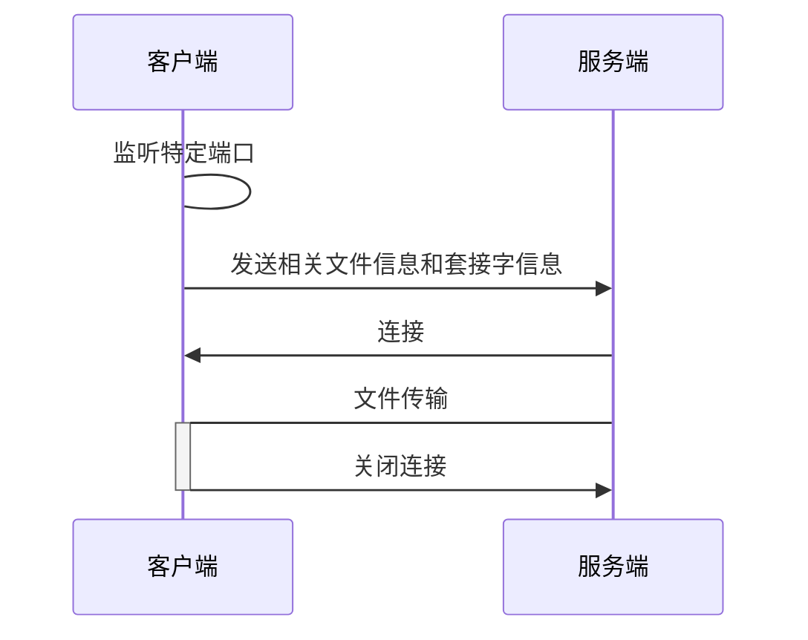

# 文件传输

# 思路




在文件传输中，有两个用于通信的套接字，一个是主套接字，是命令通道，用于收发各种请求消息；另一个是副套接字，是数据通道，只用于传输文件数据。

为了降低通信的复杂性，是由服务端发起连接到客户端建立的套接字，该套接字只用于传输文件数据，请求队列的最大长度为1，是一次性的。

首先是客户端建立副套接字，然后使用命令通道向服务器发送副套接字信息和文件传输请求，服务器通过命令通道收到文件传输请求消息后，使用副套接字连接到客户端副套接字，从而建立数据通道，开始文件传输。


# 停止文件传输

## 基本原理

通过关闭相应文件传输任务的套接字，导致该套接字抛出异常，停止该套接字收发数据，从而停止文件传输任务。因为每一个文件传输任务都会开启一个新的子线程，所以可以在主线程中关闭文件传输任务的套接字。

## 源码实现

### 存储文件传输任务

为了在主线程管理文件传输任务，在主线程中使用字典存储每一个文件传输任务，使用传输方向和文件名的生成UUID（唯一性）作为键，对应的套接字作为值。通过管理该文件传输任务字典从而达到管理所有的文件传输任务。

```python
# 文件传输任务字典
fileTransferTasks = {uuid1:套接字1, uuid2:套接字2, ...}
```

### 获取文件传输任务的UUID

```python
def getFileUUID(self, fileName):
    return str(uuid.uuid5(uuid.NAMESPACE_DNS, fileName))
```

### 防止文件传输任务重复

```python
def isExistFileTrasferTask(self, fileUUID):
    if (fileUUID in self.fileTransferTasks):
        return True
    else:
        return False
```

### 添加文件传输任务

```python
def addFileTransferTask(self, fileName, fileSock):
    fileUUID = self.getFileUUID(fileName)
    if self.isExistFileTrasferTask(self.isExistFileTrasferTask(fileUUID)):
        return False
    self.fileTransferTasks[fileUUID] = fileSock
    print('【文件任务】', '添加', fileName, fileUUID)
    return True
```

### 移除文件传输任务

```python
def removeFileTransferTask(self, fileName):
    fileUUID = self.getFileUUID(fileName)
    if not self.isExistFileTrasferTask(fileUUID):
        return None
    fileSock = self.fileTransferTasks[fileUUID]
    del self.fileTransferTasks[fileUUID]
    print('\n【文件任务】', '移除', fileName, fileUUID)
    return fileSock
```

### 停止文件传输任务

```python
def interruptFileTransfer(self, fileName, isUpload):
    print('\n【阻止传输】', fileName)
    if isUpload:
        fileName = 'UPLOAD' + fileName
    else:
        fileName = 'DOWNLOAD' + fileName
    fileSock = self.removeFileTransferTask(fileName)
    if not fileSock:
        return False
    else:
        fileSock.close() # 关键
        return True
```


## 遇到的问题

### 描述

在本例中，上传文件时，客户端一方作为文件服务器因为网络原因被动停止或用户主动停止文件传输，导致客户端一方的文件服务器套接字关闭，服务端一方不能正常关闭通信。

### 分析

在客户端一方的文件服务器套接字关闭或异常时，服务端一方会一直处于接收`b''`空字节类型死循环状态（非阻塞）。

### 解决

如果接收到`b''`空字节类型，服务端一方退出死循环，并关闭通信。

```python
# 服务端一方接收客户端的文件上传核心过程
try:
    while not fileSzieRecv == fileSizeTotal:
        if (fileSizeTotal - fileSzieRecv > self.BUFSIZE):
            rData = fileSock.recv(self.BUFSIZE)
            fileSzieRecv += len(rData)
            # 因为Python中recv()是阻塞的(握手挥手)，只有连接断开或异常(send)时，接收到的是b''空字节类型，因此需要判断这种情况就断开连接。
            if (b'' == rData):
                raise Exception('文件上传通道已关闭') # 退出死循环
                
        else:
            rData = fileSock.recv(fileSizeTotal - fileSzieRecv)
            fileSzieRecv = fileSizeTotal
            print('【文件上传】', '结束', fileSizeTotal, absFileName)
        fp.write(rData)
except:
    self.errorHandle('文件上传通道已关闭', False)
finally:
    fp.close()
    fileSock.close() # 关闭通信
```


